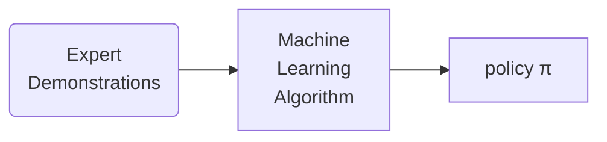

# Imitation Learning



# Behavior Cloning

## Setting

*   Discounted infinite horizon MDP \mathscr{M}={S,A,\gamma,r,P,\rho,\pi^\*}

*   Ground truth reward r(s,a) \in\[0,1] is unknown; assume expert is near optimal policy \pi^\*

*   We have a dataset \mathscr D = (s\_i^*, a\_i^*)\_{i=1}^M\sim d^{\pi^\*}

> 💡 Goal: learn a policy \mathscr D that is as good as the expert \pi^\*

## BC Algorithm

*   Input: a restricted policy class \Pi = {\pi:S\rightarrow\Delta(A)}

*   BC with Maximum Likelihood estimation

    ```undefined
    \hat\pi = \argmax_{\pi\in\Pi}\sum_{i=1}^M\ln\pi(a_i^*|s_i^*)
    ```

### Analysis

*   Assumption: \Pi is discrete and relizable, i.e., \pi^\* \in\Pi

*   Supervised learning (MLE) guarantee with probability at least 1-\delta, we have

    ```undefined
    \mathbb E_{s\sim d^{\pi^*}}\left\| \hat\pi(\cdot|s)-\pi^*(\cdot|s)\right\|_{tv}\le\sqrt{\frac{\ln(|\Pi|/\delta)}{M}}
    ```

*   Transfer supervised learning error to policy’s performance gap

    *   With probability at least 1-\delta, BC returns a policy \hat\pi

        ```undefined
        V^{\pi^*}-V^{\hat\pi}\le\frac2{(1-\gamma)^2}\underbrace{\sqrt{\frac{\ln(|\Pi|/\delta)}{M}}}_{\text{MLE Error}}
        ```

# Hybrid Imitation Learning

## Setting

*   Offline expert data(BC’s setting) + simulator(e.g. known transition P)

*   Key Q: can we do better than offline IL behavior cloning?

## Distribution Matching

*   Integral probability metric: metric measures the divergence between two distributions

*   Given a discriminator class \mathscr F = {f:X\rightarrow\R}, and two distributions p\_1 and p\_2

    ```undefined
    \text{IPM}_{\mathscr F}(p_1,p_2)=\max_{f\in\mathscr F}\left[\mathbb E_{x\sim p_1}f(x) - \mathbb E_{x \sim p_2} f(x)\right]\\\mathscr F = \{f:\|f\|_\infty\le1\}\implies \text{IPM}_{\mathscr F}:=\|p_1-p_2\|_{tv}\\\mathscr F = \{f:\|f \text{ is 1-Lipschitz}\}\implies \text{IPM}_{\mathscr F}:=\text{wasserstein dis}(p_1,p_2)
    ```

### Algorithm

*   Consider the discriminator class \mathscr F={f:|f|\_\infty\le 1}

*   For each \pi\in\Pi, compute d^\pi\in\Delta(S\times A)

*   Select useful discribminators: for all pair \pi & \pi', with \pi\neq\pi’

    ```undefined
    f_{\pi,\pi'}=\argmax_{f\in\mathscr F}\left[\mathbb E_{s,a\sim d^\pi}f(s,a)-\mathbb E_{s,a \sim d^{\pi'}}f(s,a) \right]
    ```

    Set refined discriminator class \widetilde{\mathscr F}:= {f\_{\pi,\pi'}:\pi&\pi'\in\Pi,\pi\neq\pi'}

*   Set a policy using expert dataset \mathscr D = {s\_i^*,a\_i^*}\_{i=1}^M

    ```undefined
    \hat\pi:=\argmin_{\pi\in\Pi}\left[\max_{f\in\mathscr F}\left[\mathbb E_{s,a\sim d^\pi f(s,a)}-\frac1M\sum_{i=1}^M f(s_i^*,a_i^*)\right]\right]
    ```

### Theorem: Distribution Matching TV distance

*   With probability at least 1-\delta, our algorithm finds policy \hat\pi s.t

    ```undefined
    V^{\pi^*}-V^{\hat\pi}\le\mathcal O\left(\frac1{1-\gamma}\sqrt{\frac{\ln(|\Pi|/\delta)}M}\right)
    ```

*   Key step is to prove

    ```undefined
    \left\|d^{\hat\pi}-d^{\pi^*}\right\|_{tv}\le\sqrt{\frac{\ln(|\Pi|/\delta)}M}
    ```

*   For performance

    ```undefined
    V^{\pi^*}-V^\pi\le\frac1{1-\gamma}[\mathbb E_{s,a\sim d^{\pi^*}}r(s,a)-\mathbb E_{s,a\sim d^{\hat\pi}}r(s,a)]
    ```
